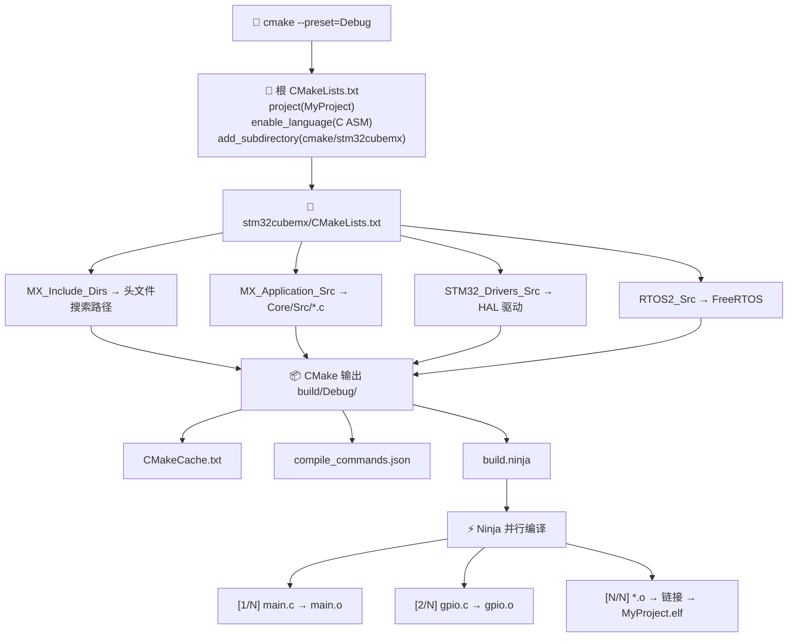

# CMake + Ninja 构建流程图

```mermaid
flowchart TB
    A["🔧 cmake --preset=Debug"]
    B["📄 根 CMakeLists.txt<br/>project(MyProject)<br/>enable_language(C ASM)<br/>add_subdirectory(cmake/stm32cubemx)"]
    C["📄 stm32cubemx/CMakeLists.txt"]
    D1["MX_Include_Dirs → 头文件搜索路径"]
    D2["MX_Application_Src → Core/Src/*.c"]
    D3["STM32_Drivers_Src → HAL 驱动"]
    D4["RTOS2_Src → FreeRTOS"]
    E["📦 CMake 输出 build/Debug/"]
    E1["CMakeCache.txt"]
    E2["compile_commands.json"]
    E3["build.ninja"]
    F["⚡ Ninja 并行编译"]
    F1["[1/N] main.c → main.o"]
    F2["[2/N] gpio.c → gpio.o"]
    F3["[N/N] *.o → 链接 → MyProject.elf"]

    A --> B
    B --> C
    C --> D1
    C --> D2
    C --> D3
    C --> D4
    D1 --> E
    D2 --> E
    D3 --> E
    D4 --> E
    E --> E1
    E --> E2
    E --> E3
    E3 --> F
    F --> F1
    F --> F2
    F --> F3
```